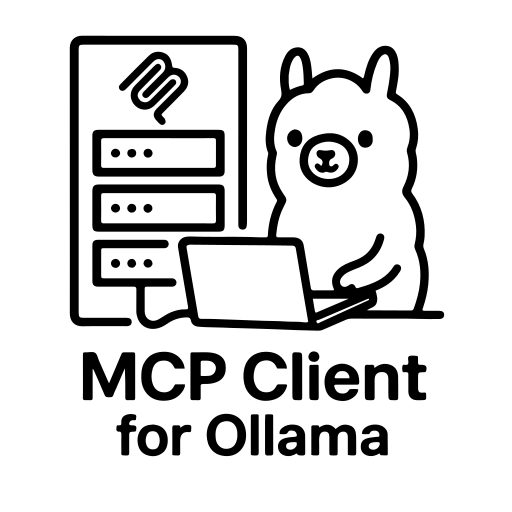

<p align="center">
  
</p>
<p align="center">
<i>A simple yet powerful Python client for interacting with Model Context Protocol (MCP) servers using Ollama, allowing local LLMs to use tools.</i>
</p>

---

# MCP Client for Ollama (ollmcp)

[](https://www.python.org/downloads/)
[](https://pypi.org/project/ollmcp/)
[](https://pypi.org/project/mcp-client-for-ollama/)
[](https://github.com/jonigl/mcp-client-for-ollama/actions/workflows/publish.yml)
[](https://github.com/jonigl/mcp-client-for-ollama/actions/workflows/ci.yml)

<p align="center">
  
</p>

## Overview

This project provides a robust Python-based client that connects to one or more Model Context Protocol (MCP) servers and uses Ollama to process queries with tool use capabilities. The client establishes connections to MCP servers, sends queries to Ollama models, and handles the tool calls the model makes.

This implementation was adapted from the [Model Context Protocol quickstart guide](https://modelcontextprotocol.io/quickstart/client) and customized to work with Ollama, providing a user-friendly interface for interacting with LLMs that support function calling.

## Features

- 🌐 **Multi-Server Support**: Connect to multiple MCP servers simultaneously
- 🚀 **Multiple Transport Types**: Supports STDIO, SSE, and Streamable HTTP server connections
- 🎨 **Rich Terminal Interface**: Interactive console UI
- 🖥️ **Streaming Responses**: View model outputs in real-time as they're generated
- 🛠️ **Tool Management**: Enable/disable specific tools or entire servers during chat sessions
- 🧠 **Context Management**: Control conversation memory with configurable retention settings
- 🤔 **Thinking Mode**: Advanced reasoning capabilities with visible thought processes for supported models (deepseek-r1, qwen3)
- 🔄 **Cross-Language Support**: Seamlessly work with both Python and JavaScript MCP servers
- 🔍 **Auto-Discovery**: Automatically find and use Claude's existing MCP server configurations
- 🎛️ **Dynamic Model Switching**: Switch between any installed Ollama model without restarting
- 💾 **Configuration Persistence**: Save and load tool preferences between sessions
- 📊 **Usage Analytics**: Track token consumption and conversation history metrics
- 🔌 **Plug-and-Play**: Works immediately with standard MCP-compliant tool servers
- 🔔 **Update Notifications**: Automatically detects when a new version is available

## Requirements

- **Python 3.10+** ([Installation guide](https://www.python.org/downloads/))
- **Ollama** running locally ([Installation guide](https://ollama.com/download))
- **UV package manager** ([Installation guide](https://github.com/astral-sh/uv))

## Quick Start

**Option 1:** Install with pip and run

```bash
pip install ollmcp
ollmcp
```

**Option 2:** One-step install and run

```bash
uvx ollmcp
```

**Option 3:** Install from source and run using virtual environment

```bash
git clone https://github.com/jonigl/mcp-client-for-ollama.git
cd mcp-client-for-ollama
uv venv && source .venv/bin/activate
uv pip install .
uv run -m mcp_client_for_ollama
```

## Usage

Run with default settings:

```bash
ollmcp
```

> If you don't provide any options, the client will use `auto-discovery` mode to find MCP servers from Claude's configuration.

### Command-line Arguments

#### Server Options:

- `--mcp-server`: Path to one or more MCP server scripts (.py or .js). Can be specified multiple times.
- `--servers-json`: Path to a JSON file with server configurations.
- `--auto-discovery`: Auto-discover servers from Claude's default config file (default behavior if no other options provided).

> [!TIP]
> Claude's configuration file is typically located at:
> `~/Library/Application Support/Claude/claude_desktop_config.json`

#### Model Options:

- `--model MODEL`: Ollama model to use. Default: `qwen2.5:7b`
- `--host HOST`: Ollama host URL. Default: `http://localhost:11434`

### Usage Examples

Connect to a single server:

```bash
ollmcp --mcp-server /path/to/weather.py --model llama3.2:3b
```

Connect to multiple servers:

```bash
ollmcp --mcp-server /path/to/weather.py --mcp-server /path/to/filesystem.js --model qwen2.5:latest

```

Use a JSON configuration file:

```bash
ollmcp --servers-json /path/to/servers.json --model llama3.2:1b
```

Use a custom Ollama host:

```bash
ollmcp --host http://localhost:22545 --servers-json /path/to/servers.json --model qwen3:latest
```

## Interactive Commands

During chat, use these commands:


| Command          | Shortcut         | Description                                         |
|------------------|------------------|-----------------------------------------------------|
| `help`           | `h`              | Display help and available commands                 |
| `tools`          | `t`              | Open the tool selection interface                   |
| `model`          | `m`              | List and select a different Ollama model            |
| `context`        | `c`              | Toggle context retention                            |
| `thinking-mode`  | `tm`             | Toggle thinking mode (deepseek-r1, qwen3 only)      |
| `show-thinking`  | `st`             | Toggle thinking text visibility                     |
| `clear`          | `cc`             | Clear conversation history and context              |
| `context-info`   | `ci`             | Display context statistics                          |
| `cls`            | `clear-screen`   | Clear the terminal screen                           |
| `save-config`    | `sc`             | Save current tool and model configuration to a file |
| `load-config`    | `lc`             | Load tool and model configuration from a file       |
| `reset-config`   | `rc`             | Reset configuration to defaults (all tools enabled) |
| `quit`, `exit`   | `q` or `Ctrl+D`  | Exit the client                                     |

### Tool and Server Selection

The tool and server selection interface allows you to enable or disable specific tools:


- Enter **numbers** separated by commas (e.g. `1,3,5`) to toggle specific tools
- Enter **ranges** of numbers (e.g. `5-8`) to toggle multiple consecutive tools
- Enter **S + number** (e.g. `S1`) to toggle all tools in a specific server
- `a` or `all` - Enable all tools
- `n` or `none` - Disable all tools
- `d` or `desc` - Show/hide tool descriptions
- `s` or `save` - Save changes and return to chat
- `q` or `quit` - Cancel changes and return to chat

### Model Selection

The model selection interface shows all available models in your Ollama installation:


- Enter the **number** of the model you want to use
- `s` or `save` - Save the model selection and return to chat
- `q` or `quit` - Cancel the model selection and return to chat

## Configuration Management

> [!TIP]
> It will automatically load the default configuration from `~/.config/ollmcp/config.json` if it exists.

The client supports saving and loading tool configurations between sessions:

- When using `save-config`, you can provide a name for the configuration or use the default
- Configurations are stored in `~/.config/ollmcp/` directory
- The default configuration is saved as `~/.config/ollmcp/config.json`
- Named configurations are saved as `~/.config/ollmcp/{name}.json`

The configuration saves:

- Current model selection
- Enabled/disabled status of all tools
- Context retention settings
- Thinking mode settings

## Server Configuration Format

The JSON configuration file supports STDIO, SSE, and Streamable HTTP server types:

```json
{
  "mcpServers": {
    "stdio-server": {
      "command": "command-to-run",
      "args": ["arg1", "arg2", "..."],
      "env": {
        "ENV_VAR1": "value1",
        "ENV_VAR2": "value2"
      },
      "disabled": false
    },
    "sse-server": {
      "type": "sse",
      "url": "http://localhost:8000/sse",
      "headers": {
        "Authorization": "Bearer your-token-here"
      },
      "disabled": false
    },
    "http-server": {
      "type": "streamable_http",
      "url": "http://localhost:8000/mcp",
      "headers": {
        "X-API-Key": "your-api-key-here"
      },
      "disabled": false
    }
  }
}
```
> [!NOTE]
> If you specify a URL without a type, the client will default to using Streamable HTTP transport.

## Compatible Models

The following Ollama models work well with tool use:

- qwen2.5
- qwen3
- llama3.1
- llama3.2
- mistral

For a complete list of Ollama models with tool use capabilities, visit the [official Ollama models page](https://ollama.com/search?c=tools).

### How Tool Calls Work

1. The client sends your query to Ollama with a list of available tools
2. If Ollama decides to use a tool, the client:
   - Extracts the tool name and arguments
   - Calls the appropriate MCP server with these arguments
   - Sends the tool result back to Ollama
   - Shows the final response

## Where Can I Find More MCP Servers?

You can explore a collection of MCP servers in the official [MCP Servers repository](https://github.com/modelcontextprotocol/servers).

This repository contains reference implementations for the Model Context Protocol, community-built servers, and additional resources to enhance your LLM tool capabilities.

## License

This project is licensed under the MIT License - see the [LICENSE](LICENSE) file for details.

## Acknowledgments

- [Model Context Protocol](https://modelcontextprotocol.io/) for the specification and examples
- [Ollama](https://ollama.com/) for the local LLM runtime
- [Rich](https://rich.readthedocs.io/) for the terminal user interface

---

Made with ❤️ by [jonigl](https://github.com/jonigl)
